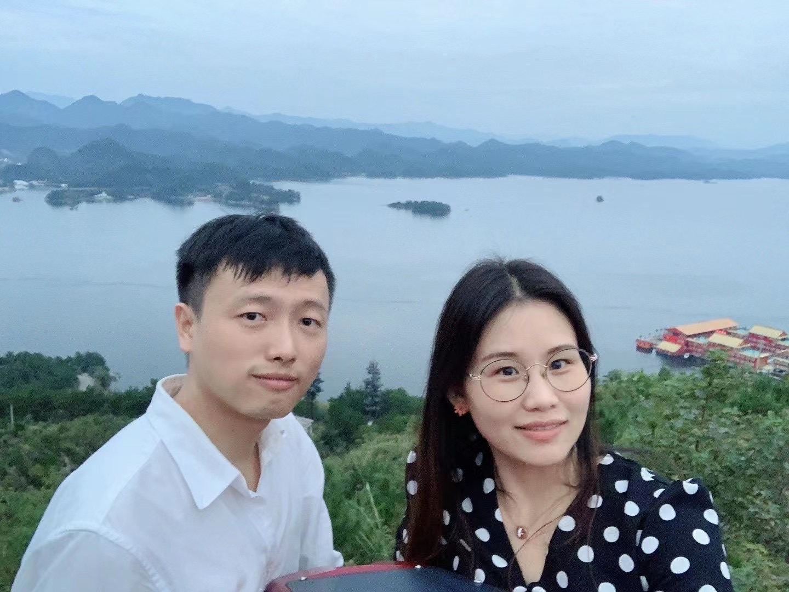

```{r setup, include=FALSE}
knitr::opts_chunk$set(echo = FALSE)
```

```{r, echo=FALSE, out.width="75%", fig.cap="俺与夫人"}

```

## 研究兴趣

宏微观研究，氛围与古法编程，烹饪。

## 软件作品

[理杏仁 API 的 R 语言封装](https://github.com/tanchangde/lixingr2)

## 联系方式

Email: tanchangde@gmail.com
博客: tanchangde.com
现居海南海口、湖南衡阳
